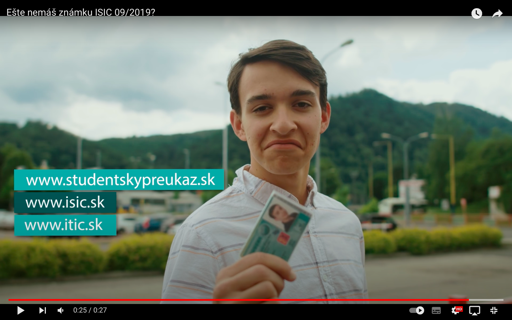
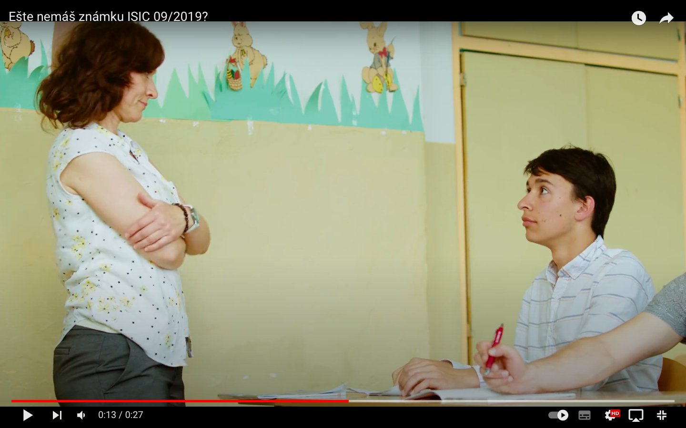
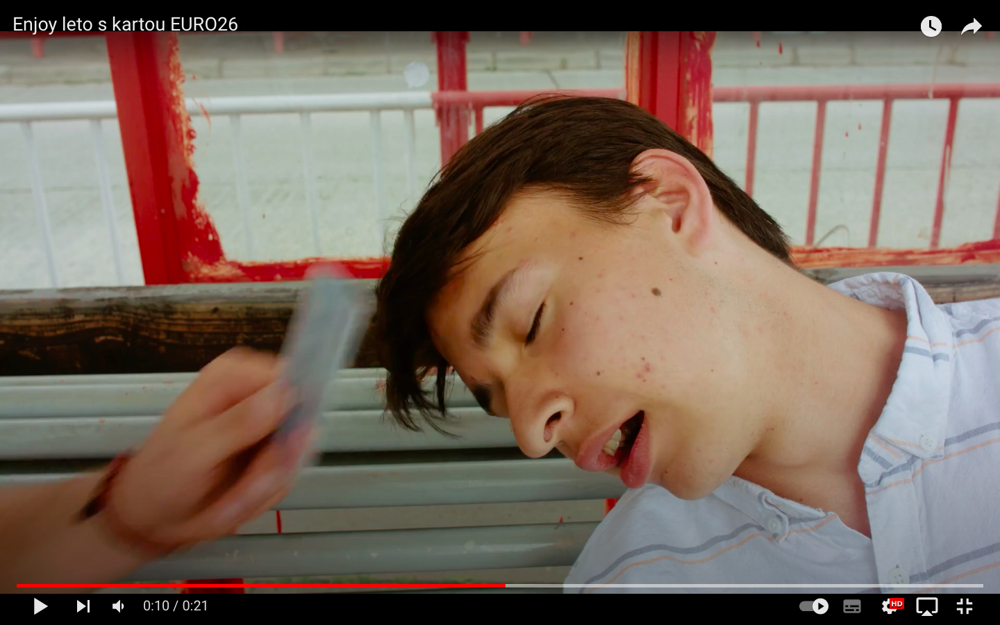

# The performance in Add (2018)

## The story of how I became the main actor in the student ISIC add:
I created a music video for the Slovak MobileFest competition and received the 1st Award place. They loved both my idea and performance, leading to the opportunity for me to collaborate with them as the main character.

## Challenges:
We had to be flexible because we required good weather, and during that time, I was also studying at a private high school with strict attendance policies. I tried to imagine some of my life situations as a student so that I could portray my student character in the ad as trustworthy and funny. In the end, they were satisfied with my performance, which was rewarding.

# BACK TO THE:
## [Main Page (English for designers)](https://github.com/BenjaminHaverla/English-for-designers.git)
## [Benjamín Haverla](https://github.com/BenjaminHaverla/First-impression.git)
# Contact me:
## **Mail**: haverla.tros@gmail.com
